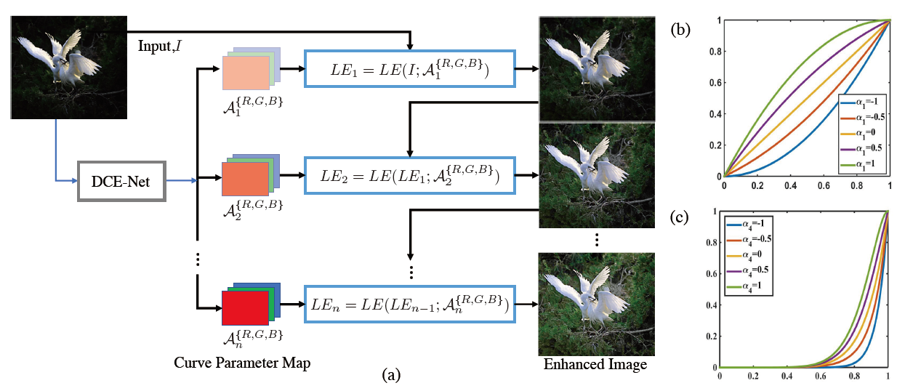
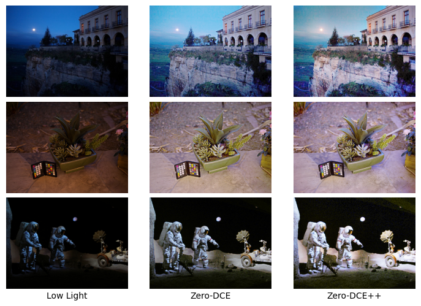

# Zero-DCE

A Jax/Flax implementation of *[TIP 2021 paper](https://ieeexplore.ieee.org/document/9369102), "Learning to Enhance Low-Light Image via Zero-Reference Deep Curve Estimation"*



## Requirements

- Python >= 3.6
- [JAX](https://github.com/google/jax)
- requirements.txt

## Dataset Preparation

Zero-DCE is trained by a subset of SICE dataset, which can be downloaded from [Google Drive](https://drive.google.com/file/d/1GAB3uGsmAyLgtDBDONbil08vVu5wJcG3)

## Quick Startup

Directly run on [Colab](https://colab.research.google.com/github/biubiubiiu/Zero-DCE/blob/main/zero-dce.ipynb)

## Training

```bash
# Train Zero-DCE model
python train.py --model=Zero-DCE --train_dir=$DATA_DIR [--optional arguments]

# Train Zero-DCE++ model
python train.py --model=Zero-DCE++ --train_dir=$DATA_DIR [--optional arguments]
```
## Testing

```bash
# Test Zero-DCE model
python test.py --model=Zero-DCE --ckpt_path=${CKPT_PATH}  [--optional arguments]

# Test Zero-DCE++ model
python test.py --model=Zero-DCE++ --ckpt_path=${CKPT_PATH}  [--optional arguments]
```

## Network Complexity

|   Method   |  Input shape   |     Flops     | Params  |
| :--------: | :------------: | :-----------: | :-----: |
|  Zero-DCE  | (3, 1200, 900) | 84.990 GFlops | 0.079 M |
| Zero-DCE++ | (3, 1200, 900) | 0.115 GFlops  | 0.010 M |

## Results

